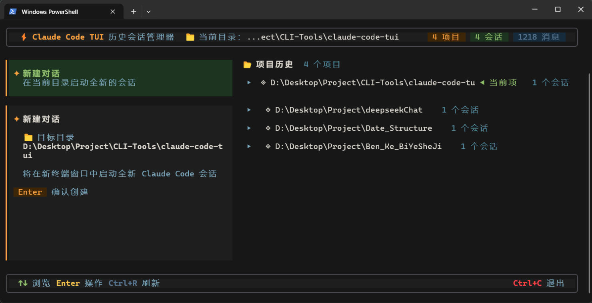
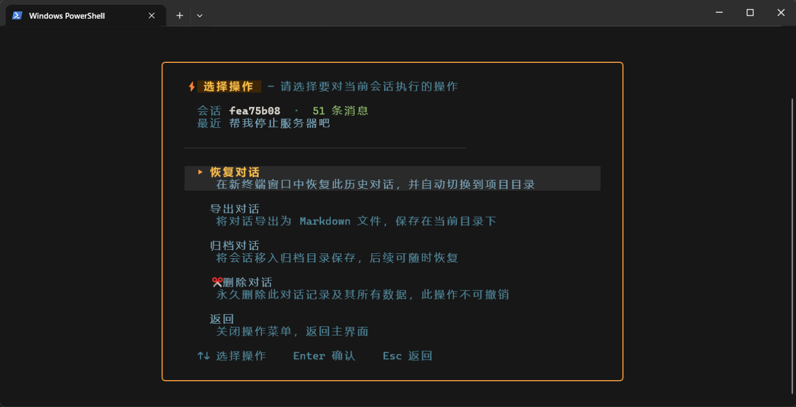
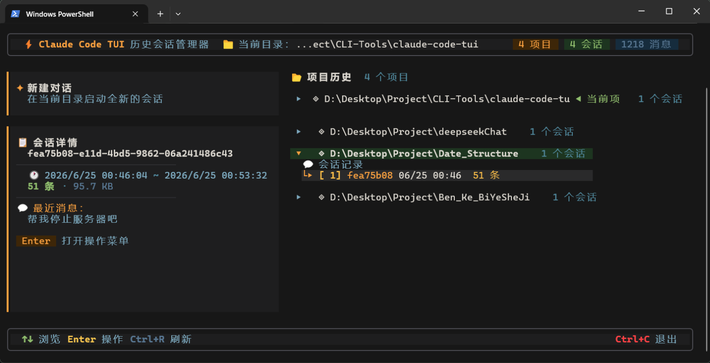

# Claude Code TUI

> 终端历史会话管理器 — 在终端里浏览、搜索、管理 Claude Code 的对话历史。



## 功能

- **浏览历史会话** — 按项目分组，显示每个会话的时间、消息数、摘要
- **断点续聊** — 选择历史会话，在新终端窗口中恢复对话（`--resume`）
- **新建对话** — 在当前目录一键启动新会话
- **会话操作** — 归档、删除、导出为 Markdown
- **孤项目检测** — 自动识别目录已被删除的项目，支持迁移到新路径
- **实时更新** — 文件监听，Claude Code 写入时自动刷新
- **键盘驱动** — 全键盘操作（vim 键位 `j/k/h/l` 也支持）
- **跨平台** — Windows Terminal / PowerShell / macOS / Linux 均可运行

## 截图

| 操作菜单 | 新建对话 |
|:---:|:---:|
|  |  |

## 安装

### Windows

在项目目录下以管理员身份打开 PowerShell，运行：

```powershell
.\install.ps1
```

### macOS / Linux

```bash
bash install.sh
```

安装脚本会自动：
1. 检查 Node.js 环境（版本不满足时自动下载便携版）
2. 安装依赖并编译 TypeScript
3. 配置环境变量和 shell 函数，之后在终端输入 `claude` 即可打开 TUI

## 手动安装

```bash
npm install
npm run build
node dist/main.js
```

## 运行

安装完成后，在任意目录打开终端，输入：

```bash
claude
```

TUI 启动失败时会自动回退到原始 `claude` 命令。

## 快捷键

| 按键 | 操作 |
|:---|:---|
| `↑` `↓` / `j` `k` | 上下浏览项目/会话 |
| `Enter` | 选择 / 确认 / 打开操作菜单 |
| `Esc` | 返回 / 退出 |
| `←` `→` / `h` `l` | 切换 是/否 选项 |
| `Ctrl+R` | 刷新数据 |

## 技术栈

- [Ink](https://github.com/vadimdemedes/ink) — React for CLI
- [React](https://react.dev) 19
- TypeScript

## 许可证

MIT
